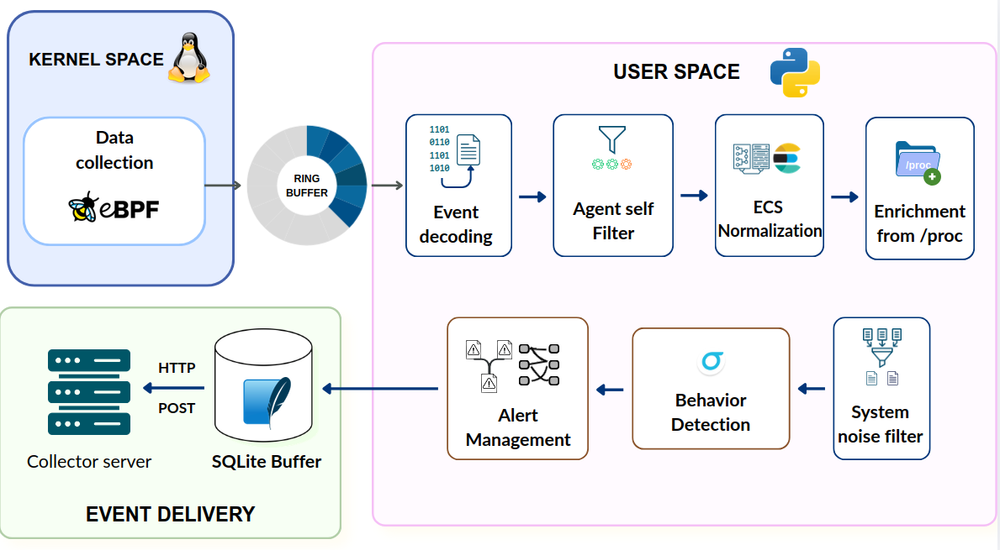

# Linux Process Context Agent

A Linux endpoint monitoring prototype that captures process and network activity with eBPF, enriches events with runtime context, applies Sigma-style detection rules, and exports structured ECS-inspired JSON events.

> Developed as part of a bachelor's thesis on contextual Linux process analysis and anomaly detection.

## Overview

Traditional process monitoring based on periodic polling can miss short-lived processes and often provides limited execution context. This project collects selected events close to the moment they occur in the Linux kernel, while keeping normalization, enrichment, detection, and delivery logic in user space.

<p align="center">
  
</p>


## Main capabilities

- Captures process execution through `execve` and `execveat`.
- Captures IPv4 connection activity through `connect`, `accept`, and `accept4`.
- Collects process, user, command-line, executable, IP, and port information.
- Enriches events with data from `/proc`, including executable paths and SHA-256 hashes when available.
- Normalizes events into ECS-inspired JSON documents.
- Evaluates local YAML rules using a practical subset of Sigma operators.
- Filters agent-generated events and repetitive operational noise.
- Deduplicates alerts and correlates related events within configurable time windows.
- Stores events locally in SQLite before HTTP delivery.
- Retries failed deliveries using a backoff mechanism.

Example detections include:

- execution from writable temporary directories;
- access to sensitive account files;
- local reconnaissance commands;
- use of `curl` or `wget` with external URLs;
- outbound connections to unusual ports.

## Example alert

Running an executable from `/tmp` can generate an alert similar to:

```json
{
  "event": {
    "kind": "alert",
    "action": "process_started"
  },
  "process": {
    "name": "edr_tmp_exec",
    "executable": "/tmp/edr_tmp_exec"
  },
  "rule": {
    "id": "lab-process-execution-from-writable-tmp",
    "level": "high"
  },
  "edr": {
    "detection": {
      "matched": true,
      "engine": "sigma"
    }
  }
}
```

## Technology stack

| Area | Technologies |
| --- | --- |
| Kernel telemetry | eBPF, BCC, C |
| Agent and processing | Python 3 |
| Event representation | ECS-inspired JSON |
| Detection rules | Sigma-style YAML |
| Process enrichment | Linux `/proc`, SHA-256 |
| Local persistence | SQLite |
| Event delivery | HTTP, batching, retry, backoff |
| Deployment and testing | systemd, pytest, shell scripts |

## Quick start

### Requirements

- Linux with eBPF and BCC support
- Python 3
- Kernel headers for the running kernel
- Root privileges for loading eBPF programs

Example dependencies for Ubuntu/Debian:

```bash
sudo apt update
sudo apt install -y \
  bpfcc-tools python3-bpfcc linux-headers-$(uname -r) \
  python3-yaml python3-requests python3-pytest jq sqlite3
```

Clone the repository:

```bash
git clone https://github.com/AndreeaStati/Linux_Process_Context_Agent.git
cd Linux_Process_Context_Agent
```

### Run with systemd

The repository includes service definitions for the agent and the local collector:

```text
deploy/systemd/edr-agent.service
deploy/systemd/edr-receiver.service
```

Review the service files and update environment-specific values such as `WorkingDirectory`, `ExecStart`, the configuration path, and the service user.

Install and start the services:

```bash
sudo cp deploy/systemd/edr-agent.service /etc/systemd/system/
sudo cp deploy/systemd/edr-receiver.service /etc/systemd/system/

sudo systemctl daemon-reload
sudo systemctl enable --now edr-receiver
sudo systemctl enable --now edr-agent
```

Check their status:

```bash
sudo systemctl status edr-receiver --no-pager
sudo systemctl status edr-agent --no-pager
```

Inspect recent logs:

```bash
sudo journalctl -u edr-receiver -n 20 --no-pager
sudo journalctl -u edr-agent -n 20 --no-pager
```

The local collector interface is available at:

```text
http://127.0.0.1:8080/ui?limit=5
```

## Demo

Run all included scenarios:

```bash
bash tools/scenarios/run_all.sh
```

A representative test for execution from a temporary directory:

```bash
START_LINE=$(wc -l < data/received_events.jsonl)

cp /bin/true /tmp/edr_tmp_exec
chmod +x /tmp/edr_tmp_exec
/tmp/edr_tmp_exec

sleep 2

tail -n +$((START_LINE+1)) data/received_events.jsonl | jq '
  select(tostring | contains("edr_tmp_exec"))
'
```

Additional scenarios under `tools/scenarios/` cover reconnaissance activity, sensitive file access, network connections, and external URL access.

The project also includes a store-and-forward test that demonstrates local SQLite buffering and automatic retransmission after the HTTP collector becomes available again.

## Tests

Run the unit tests:

```bash
pytest tests/unit_tests -q
```

## Repository structure

```text
├── ebpf/              # eBPF sensors and shared event structures
├── user_space/        # event processing, detection and delivery pipeline
├── rules/             # process and network detection rules
├── config/            # runtime configuration
├── tools/             # collector, UI and demonstration scenarios
├── tests/             # unit, integration and manual tests
├── deploy/systemd/    # systemd service definitions
└── data/              # local runtime output and SQLite buffer
```

## Configuration

The main configuration file is:

```text
config/dev.yaml
```

It controls filtering, enrichment, rule loading, deduplication, correlation, HTTP delivery, and SQLite buffering.

Selected settings can also be overridden through environment variables:

```text
EDR_OUTPUT_MODE
EDR_OUTPUT_DEBUG
EDR_HTTP_ENDPOINT
EDR_HTTP_BATCH_SIZE
EDR_HTTP_FLUSH_INTERVAL
EDR_HTTP_TIMEOUT
AGENT_EVENTS_DB
```

## Project scope

This repository is an academic prototype that demonstrates an end-to-end Linux endpoint monitoring pipeline, from kernel event collection to contextual processing, rule-based detection, alert management, persistent buffering, and HTTP delivery.

It is not intended to replace a production EDR platform. Current limitations include a selected set of monitored system calls, IPv4-focused network events, a locally implemented subset of Sigma, and potentially incomplete `/proc` enrichment for very short-lived processes.
